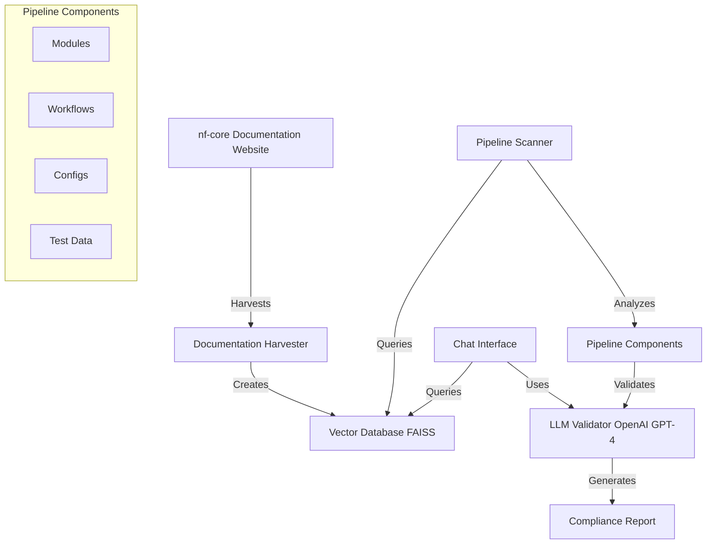

```mermaid
graph TD
    A[nf-core Documentation Website] -->|Harvests| B[Documentation Harvester]
    B -->|Creates| C[Vector Database FAISS]
    D[Pipeline Scanner] -->|Queries| C
    D -->|Analyzes| E[Pipeline Components]
    E -->|Validates| F[LLM Validator OpenAI GPT-4]
    F -->|Generates| G[Compliance Report]
    H[Chat Interface] -->|Queries| C
    H -->|Uses| F

    subgraph Pipeline Components
        E1[Modules]
        E2[Workflows]
        E3[Configs]
        E4[Test Data]
    end
```

*Note: To view this diagram, you need a Markdown viewer that supports Mermaid diagrams, such as GitHub or VS Code with the Mermaid extension.*
