# How the nf-core Validator Works

This document explains the architecture and workflow of the nf-core validator, a RAG-based AI agent that analyzes Nextflow pipelines for compliance with nf-core guidelines.

## Architecture Overview

The nf-core validator uses a Retrieval-Augmented Generation (RAG) architecture with these main components:

1. **Documentation Harvester**: Scrapes the nf-core documentation website
2. **Excel Harvester**: Alternative harvester that loads guidelines from an Excel template
3. **Pipeline Scanner**: Identifies and analyzes pipeline components
4. **Validator**: Checks components against guidelines using LLM-based analysis
5. **Chat Interface**: Interactive system for querying the nf-core documentation
6. **Report Generator**: Creates formatted compliance reports



## Key Components and Workflows

### 1. Harvesting System

Two options for harvesting guidelines, both using HuggingFace embeddings by default (no API key required):

#### Documentation Harvester
```bash
# Using HuggingFace embeddings by default (no API key required)
nfcore-validator harvest

# OpenAI/Anthropic keys can be provided but are not used for harvesting
# They are only stored for compatibility with later commands
nfcore-validator harvest --openai-api-key "your-api-key"
```

This process:
- Scrapes the nf-core documentation website
- Extracts guidelines for modules, workflows, and other components
- Chunks the text into manageable pieces
- Creates vector embeddings using HuggingFace models (default)
- Stores these embeddings in a FAISS vector database

#### Excel Harvester
```bash
# No API key required
nfcore-validator harvest --excel-template /path/to/template.xlsx
```

This process:
- Loads guidelines from a structured Excel template
- Organizes requirements by category and component type
- Creates embeddings using HuggingFace models
- Stores these embeddings in a FAISS vector database

### 2. Pipeline Scanner

This component:
1. Locates and categorizes all components in a pipeline:
   - Modules (modules/**/*.nf)
   - Workflows (workflows/*.nf)
   - Subworkflows (subworkflows/**/*.nf)
   - Main workflow (main.nf)
   - Configuration files (nextflow.config, conf/*.config)
   - Pipeline files (README.md, CHANGELOG.md, LICENSE, etc.)
   - Test data (tests/)

2. Uses a `ThreadPoolExecutor` to process components in parallel
3. Implements sophisticated rate limiting and retry logic
4. Handles API errors and throttling

### 3. Validator System

Two validator types are available:

#### LLM Validator
Uses the FAISS vector store to retrieve relevant guidelines for each component, then sends those guidelines along with the component code to an LLM for analysis. Supports two LLM providers:

- **OpenAI GPT-4** (requires OpenAI API key)
  ```python
  self.llm = ChatOpenAI(
      temperature=0, 
      model="gpt-4",
      openai_api_key=self.openai_api_key
  )
  ```

- **Anthropic Claude** (requires Anthropic API key)
  ```python
  self.anthropic_client = anthropic.Anthropic(api_key=self.anthropic_api_key)
  response = self.anthropic_client.messages.create(
      model="claude-3-7-sonnet-20250219",
      max_tokens=4096,
      system=system_prompt,
      messages=[{"role": "user", "content": prompt}]
  )
  ```

#### Excel Validator
Uses requirements defined in an Excel template for validation rather than extracting guidelines from nf-core documentation.

### 4. Chat Interface

The chat interface provides an interactive way to query the nf-core documentation (requires API key):

```bash
# With OpenAI (requires API key)
nfcore-validator chat --openai-api-key "your-api-key"

# With Anthropic Claude (requires API key)
nfcore-validator chat --model-provider anthropic --anthropic-api-key "your-api-key"
```

This component:
1. Loads the same vector store used for validation
2. Retrieves relevant documentation chunks for user questions
3. Categorizes sources by documentation section
4. Can display detailed source information with `--show-sources`
5. Supports adjustable context size with `--context-size`

### 5. Report Generator

The system generates three report formats:

1. **JSON Report**: Raw validation data in a structured format
2. **Markdown Report**: Formatted human-readable report with detailed analyses
3. **XML Report**: Structured format for integration with other tools

## Technical Implementation Details

### Command Line Interface

The system provides a unified CLI with three main commands:

```
nfcore-validator harvest  # Create the knowledge base (no API key required)
nfcore-validator validate # Validate a pipeline (API key required)
nfcore-validator chat     # Interactive documentation chat (API key required)
```

All commands support both OpenAI and Anthropic integrations with relevant flags.

### Embedding System

The system now uses HuggingFace embeddings by default:

```python
self.embeddings = HuggingFaceEmbeddings(model_name="all-MiniLM-L6-v2")
```
   - Runs locally, no API key required
   - Used for both document indexing and query embedding
   - Works with both the harvester and validator components

### RAG Implementation

The RAG workflow operates as follows:

1. **Retrieval**: Find relevant documentation for each component
   ```python
   docs = vectorstore.similarity_search(query, k=context_size)
   ```

2. **Augmentation**: Combine component code with relevant guidelines
   ```python
   prompt = f"""
   Component Path: {component_path}
   Component Type: {file_type}
   
   Component Content:
   ```
   {code[:8000]}
   ```
   
   Relevant Guidelines:
   {guidelines}
   """
   ```

3. **Generation**: LLM analysis with structured output
   ```python
   {
     "component_type": "module|workflow|subworkflow|pipeline_file|config_file|test_data",
     "path": "original_path",
     "requirements": [
       {
         "id": "requirement_id",
         "description": "requirement_description",
         "status": "passed|failed",
         "fix": "suggestion_if_failed"
       }
     ],
     "summary": {
       "passed": number_of_passed_requirements,
       "failed": number_of_failed_requirements,
       "compliance_score": percentage_score
     }
   }
   ```

### API Key Usage

The system has the following API key requirements:

1. **Harvest command**: No API key required (uses HuggingFace embeddings locally)
2. **Validate command**: Requires API key based on model provider
   - OpenAI: Requires OpenAI API key
   - Anthropic: Requires Anthropic API key
3. **Chat command**: Requires API key based on model provider
   - OpenAI: Requires OpenAI API key
   - Anthropic: Requires Anthropic API key

### Rate Limit Handling

The system implements sophisticated rate limit detection and handling:

```python
if "Rate limit reached" in error_msg:
    wait_time = 15  # Default wait time
    # Try to extract wait time from error message
    match = re.search(r"Please try again in (\d+\.\d+)s", error_msg)
    if match:
        wait_time = float(match.group(1)) + 1  # Add a buffer
        
    print(f"Rate limited. Waiting {wait_time} seconds before continuing...")
    time.sleep(wait_time)
    
    # Retry this component
    # ...
```

Additional rate limit prevention techniques:
- Thread pool with configurable worker count (`--max-workers`)
- Small delays between API calls (`time.sleep(0.5)`)
- Automatic retry logic

## Future Enhancements

Potential improvements to the validator:

1. **Additional LLM Providers**: Support for more LLM models
2. **Custom Guideline Sets**: Allow organizations to define custom validation rules
3. **CI/CD Integration**: Run as part of pipeline development workflow
4. **Incremental Validation**: Track changes to compliance over time
5. **Interactive Fixing**: Suggest and apply fixes interactively